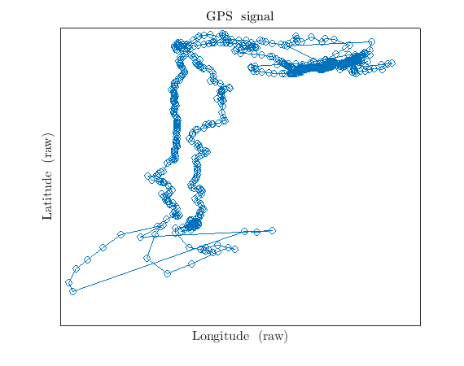

# Content of this repo

In this repo I am retrieving GNSS sensor data from a bunch of Raspberry Pi boards under different environments. Particularly, the R01 (first Raspberry, 3 model B) is running python code (using the libraries `serial`, and also `adafruit_bme280` and `RPi.GPIO` for other tests) in Raspbian OS 32 bit (a version from 2022).

# Done

I have managed to:
* open a serial port via hardware from the GPS6MV2 module to the RPi
* read NMEA sentences and split them into data fields
* store the file and scp it to my local machine
* plot a few data arrays

# Documentation

### My questions
* Signal intensity
* Transducer orientation
* Operation bands and satellites
* Satellite finding time

### What I find
The [documentation](https://components101.com/sites/default/files/component_datasheet/NEO6MV2%20GPS%20Module%20Datasheet.pdf) proposes the following bit of information

Receiver type
* 50 channels
* GPS L1
* SBAS: WAAS, EGNOS, MSAS, GAGAN

Time-To-First-Fix (All satellites at -130 dBm)
* 32s for Cold Start (autonomous)
* 32s for warm start (autonomous)
* <1s for hot start (autonomous)
* <3s for aided starts (depending on aiding data connection speed and latency)

### Accuracy

* Max navigation update rate: 5 Hz
* Horizontal position: 2.5 m (autonomous), 2.0 m (SBAS)
* Velocity: 0.1 m/s
* Heading : 0.5 degrees
* Dynamic limit: < 4 g
* Altitutude limit: 50 km
* Velocity limit: 500 m/s (1800 km/h)

### Some observations

At present, it takes some good 5 minutes to stabilise the messages received. By trial and error, I have established that the blue LED is blinking when the sensor is receiving signal (ergo, also correctly wired). This means that next points of interest to inspect are going to be:
* Check signal integrity
* Check received satellite's signal intensity/attenuation

## Example test: going shopping around the corner

It appears that the data would be useless while getting the keys from inside the house and while inside the shop. The rest of the trajectory resembles the path to the shop (with correct axes scaling). What are we missing?
* The data has to be processed
* The quality of the transducer or the board components may be only sufficiently correct for DIY purposes

